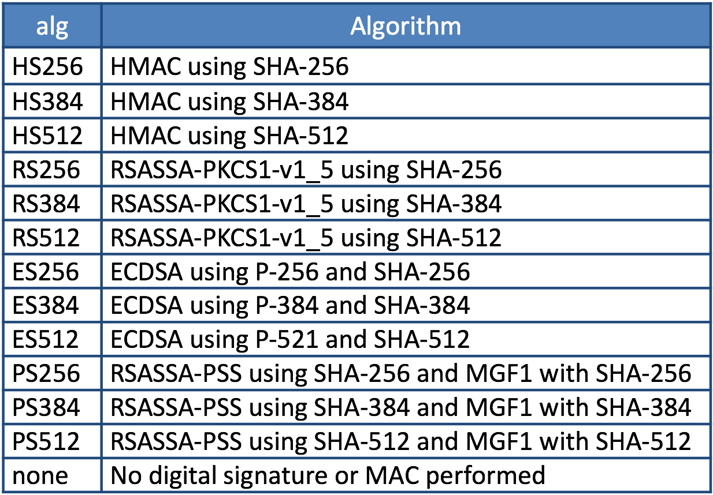
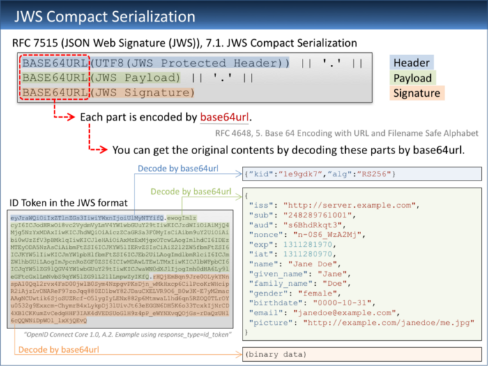
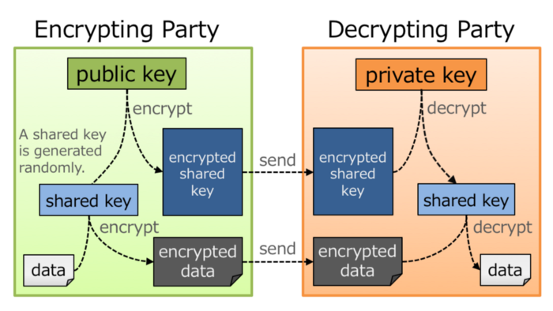
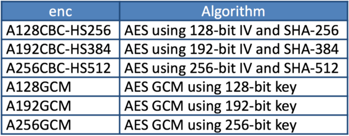
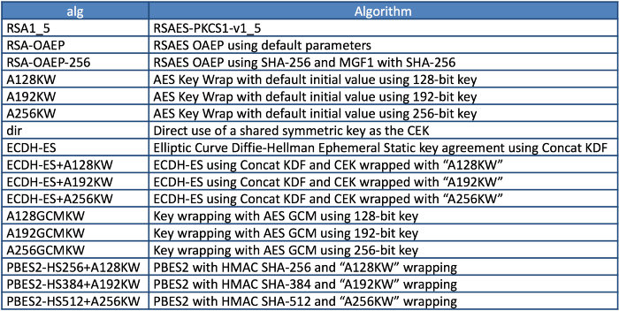
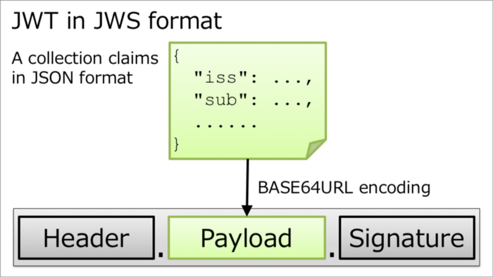
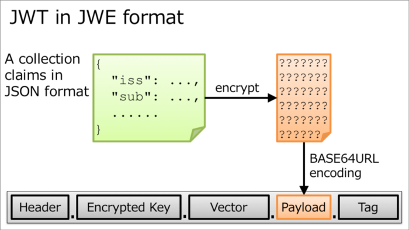
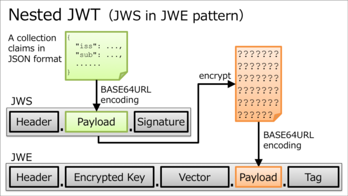
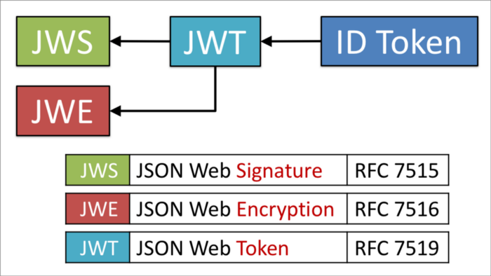

Reference: https://darutk.medium.com/understanding-id-token-5f83f50fa02e

# Understanding ID Token


## 1. Introduction

From an engineer's point of view, an abstract explanation like “ID Token is a token issued as a result of user authentication” is not so valuable because engineers cannot imagine how to implement ID Token at all by the explanation. Instead, what engineers want to know first, at least what I should have known before diving into reading OpenID Connect Core 1.0, is what an ID token looks like.

Knowledge about ID Token greatly helps engineers understand what OpenID Connect is. It's because “OpenID Connect is a specification as to how to request and issue ID tokens”.

## 2. What ID Token Looks Like

The following is an example of an ID token excerpted from “A.2. Example using response_type=id_token” in OpenID Connect Core 1.0.

```
eyJraWQiOiIxZTlnZGs3IiwiYWxnIjoiUlMyNTYifQ.ewogImlz
cyI6ICJodHRwOi8vc2VydmVyLmV4YW1wbGUuY29tIiwKICJzdWIiOiAiMjQ4
Mjg5NzYxMDAxIiwKICJhdWQiOiAiczZCaGRSa3F0MyIsCiAibm9uY2UiOiAi
bi0wUzZfV3pBMk1qIiwKICJleHAiOiAxMzExMjgxOTcwLAogImlhdCI6IDEz
MTEyODA5NzAsCiAibmFtZSI6ICJKYW5lIERvZSIsCiAiZ2l2ZW5fbmFtZSI6
ICJKYW5lIiwKICJmYW1pbHlfbmFtZSI6ICJEb2UiLAogImdlbmRlciI6ICJm
ZW1hbGUiLAogImJpcnRoZGF0ZSI6ICIwMDAwLTEwLTMxIiwKICJlbWFpbCI6
ICJqYW5lZG9lQGV4YW1wbGUuY29tIiwKICJwaWN0dXJlIjogImh0dHA6Ly9l
eGFtcGxlLmNvbS9qYW5lZG9lL21lLmpwZyIKfQ.rHQjEmBqn9Jre0OLykYNn
spA10Qql2rvx4FsD00jwlB0Sym4NzpgvPKsDjn_wMkHxcp6CilPcoKrWHcip
R2iAjzLvDNAReF97zoJqq880ZD1bwY82JDauCXELVR9O6_B0w3K-E7yM2mac
AAgNCUwtik6SjoSUZRcf-O5lygIyLENx882p6MtmwaL1hd6qn5RZOQ0TLrOY
u0532g9Exxcm-ChymrB4xLykpDj3lUivJt63eEGGN6DH5K6o33TcxkIjNrCD
4XB1CKKumZvCedgHHF3IAK4dVEDSUoGlH9z4pP_eWYNXvqQOjGs-rDaQzUHl
6cQQWNiDpWOl_lxXjQEvQ
```

In this example, there are two periods. One is the 9th character from the right on the 1st line. The other is the 22nd character from the right on the 9th line. By the two periods, an ID token is split into three fields. (The case where the number of fields is not 3 will be explained later.)

The three fields represent a header, a payload and a signature. That is, the format of an ID token is as follows:

`Header.Payload.Signature`

In the case of the example excerpted above, the header, the payload and the signature are as follows:

Header 

`eyJraWQiOiIxZTlnZGs3IiwiYWxnIjoiUlMyNTYifQ`

Payload

```
ewogImlz
cyI6ICJodHRwOi8vc2VydmVyLmV4YW1wbGUuY29tIiwKICJzdWIiOiAiMjQ4
Mjg5NzYxMDAxIiwKICJhdWQiOiAiczZCaGRSa3F0MyIsCiAibm9uY2UiOiAi
bi0wUzZfV3pBMk1qIiwKICJleHAiOiAxMzExMjgxOTcwLAogImlhdCI6IDEz
MTEyODA5NzAsCiAibmFtZSI6ICJKYW5lIERvZSIsCiAiZ2l2ZW5fbmFtZSI6
ICJKYW5lIiwKICJmYW1pbHlfbmFtZSI6ICJEb2UiLAogImdlbmRlciI6ICJm
ZW1hbGUiLAogImJpcnRoZGF0ZSI6ICIwMDAwLTEwLTMxIiwKICJlbWFpbCI6
ICJqYW5lZG9lQGV4YW1wbGUuY29tIiwKICJwaWN0dXJlIjogImh0dHA6Ly9l
eGFtcGxlLmNvbS9qYW5lZG9lL21lLmpwZyIKfQ
```

Signature

```
rHQjEmBqn9Jre0OLykYNn
spA10Qql2rvx4FsD00jwlB0Sym4NzpgvPKsDjn_wMkHxcp6CilPcoKrWHcip
R2iAjzLvDNAReF97zoJqq880ZD1bwY82JDauCXELVR9O6_B0w3K-E7yM2mac
AAgNCUwtik6SjoSUZRcf-O5lygIyLENx882p6MtmwaL1hd6qn5RZOQ0TLrOY
u0532g9Exxcm-ChymrB4xLykpDj3lUivJt63eEGGN6DH5K6o33TcxkIjNrCD
4XB1CKKumZvCedgHHF3IAK4dVEDSUoGlH9z4pP_eWYNXvqQOjGs-rDaQzUHl
6cQQWNiDpWOl_lxXjQEvQ
```

##3. JSON Web Signature (JWS)

The format of Header.Payload.Signature shown in the previous section is the format defined in “7.1. JWS Compact Serialization" in RFC 7515, JSON Web Signature (JWS). The concrete definition described in the specification is as follows:

```
BASE64URL(UTF8(JWS Protected Header)) || '.' ||
BASE64URL(JWS Payload) || '.' ||
BASE64URL(JWS Signature)
```

The definition tells that each field is encoded by base64url (RFC 4648, 5. Base 64 Encoding with URL and Filename Safe Alphabet). This means that we can get original contents by decoding the fields by base64url. Let's do it.

#### 3.1. Decoding JWS Header

First, let's decode the header field. Here I install base64-url-cli and decode the header on the command line.

```
$ npm install -g base64-url-cli
$ base64url decode eyJraWQiOiIxZTlnZGs3IiwiYWxnIjoiUlMyNTYifQ
```

As a result, we can get this JSON.

```
{"kid":"1e9gdk7","alg":"RS256"}
```

The JSON includes two parameters, `kid` and `alg`. Parameters that a JWS header may include are listed in “4.1. Registered Header Parameter Names” in RFC 7515.

Among the parameters, `alg` is important. It represents the algorithm of the signature.

#### 3.2. Decoding JWS Payload

Next, let's decode the payload field.

`$ base64url decode ewogImlzcy......LmpwZyIKfQ`

The output will become as follows:

```
{
 "iss": "http://server.example.com",
 "sub": "248289761001",
 "aud": "s6BhdRkqt3",
 "nonce": "n-0S6_WzA2Mj",
 "exp": 1311281970,
 "iat": 1311280970,
 "name": "Jane Doe",
 "given_name": "Jane",
 "family_name": "Doe",
 "gender": "female",
 "birthdate": "0000-10-31",
 "email": "janedoe@example.com",
 "picture": "http://example.com/janedoe/me.jpg"
}
```

The content of this JSON will be explained later, but one note: RFC 7515 does not require the content be JSON. The specification says the content can be “an arbitrary sequence of octets”.

#### 3.3. Decoding JWS Signature

The alg parameter in the header represents the algorithm of the signature. Valid values of alg are listed not in RFC 7515 but in “3.1. "alg" (Algorithm) Header Parameter Values for JWS” in RFC 7518, JSON Web Algorithms (JWA).



The result of decoding the header says that the value of `alg` is `RS256`. Referring to the table in “3.1. “alg” (Algorithm) Header Parameter Values for JWS”, we can find `RS256` represents “RSASSA-PKCS1-v1_5 using SHA-256”.

Because the signature by RSA algorithm is binary data, even if we decode the signature field by base64url, what we can get is binary data.

```
$ base64url decode rHQjEmBqn9......l_lxXjQEvQ | od -tu1 -An
 239 191 189 116  35  18  96 106 239 191 189 239 191 189 107 123
  67 239 191 189 239 191 189  70  13 239 191 189 239 191 189  64
 ...............................................................
  14 239 191 189 239 191 189 239 191 189 239 191 189 113  94  52
   4 239 191 189  10
```

#### 3.4. Input for Signature

Input data for signature is `Header.Payload`. In the case of the example we've used so far, the input data is as follows:

```
eyJraWQiOiIxZTlnZGs3IiwiYWxnIjoiUlMyNTYifQ.ewogImlz
cyI6ICJodHRwOi8vc2VydmVyLmV4YW1wbGUuY29tIiwKICJzdWIiOiAiMjQ4
Mjg5NzYxMDAxIiwKICJhdWQiOiAiczZCaGRSa3F0MyIsCiAibm9uY2UiOiAi
bi0wUzZfV3pBMk1qIiwKICJleHAiOiAxMzExMjgxOTcwLAogImlhdCI6IDEz
MTEyODA5NzAsCiAibmFtZSI6ICJKYW5lIERvZSIsCiAiZ2l2ZW5fbmFtZSI6
ICJKYW5lIiwKICJmYW1pbHlfbmFtZSI6ICJEb2UiLAogImdlbmRlciI6ICJm
ZW1hbGUiLAogImJpcnRoZGF0ZSI6ICIwMDAwLTEwLTMxIiwKICJlbWFpbCI6
ICJqYW5lZG9lQGV4YW1wbGUuY29tIiwKICJwaWN0dXJlIjogImh0dHA6Ly9l
eGFtcGxlLmNvbS9qYW5lZG9lL21lLmpwZyIKfQ
```

#### 3.5. Summary of Decoding JWS



#### 3.6. Unsecured JWS

Unsecured JWS is a JWS without a signature. Below is an example excerpted from “A.5. Example Unsecured JWS” in RFC 7515.

```
eyJhbGciOiJub25lIn0
.
eyJpc3MiOiJqb2UiLA0KICJleHAiOjEzMDA4MTkzODAsDQogImh0dHA6Ly9leGFt
cGxlLmNvbS9pc19yb290Ijp0cnVlfQ
.
```

The format of unsecured JWS is as follows. The signature field is empty.

`Header.Payload`

Because a signature is missing, any algorithm for a signature is not needed. Therefore, if we decode the header field of an unsecured JWS,

`$ base64url decode eyJhbGciOiJub25lIn0`

the output tells that the algorithm is none.

`{"alg":"none"}`

## 4. JSON Web Encryption (JWE)

In addition to the format of Header.Payload.Signature, there is one more format for ID Token which has 5 fields as shown below.

`Header.Key.Vector.Payload.Tag`

This format is defined in “7.1. JWE Compact Serialization” in RFC 7516, JSON Web Encryption (JWE). The concrete definition described in the specification is as follows:

```
BASE64URL(UTF8(JWE Protected Header)) || '.' ||
BASE64URL(JWE Encrypted Key) || '.' ||
BASE64URL(JWE Initialization Vector) || '.' ||
BASE64URL(JWE Ciphertext) || '.' ||
BASE64URL(JWE Authentication Tag)
```

This format is used when ID tokens need to be encrypted.

Data are encrypted and then put in the 4th field. RFC 7516 says that any data can be used as the input. However, in the context of ID Token, the data has to be a JWS. That is, a JWS is nested in a JWE.

#### 4.1. Two-Step Encryption

According to “7.1. JWE Compact Serialization”, the 2nd field of a JWE (in the format of compact serialization) is “JWE Encrypted Key”. It's not “Encryption Key” but “Encrypted Key”. There is a reason for this.

This method is not limited to JWE but used in various places; sometimes encryption is performed two times as follows.

1. Encrypt data using a shared symmetric key.
2. Encrypt the key used above using another different asymmetric key.

By using two-step encryption, we can minimize the time needed to encrypt data by using a symmetric key while we can benefit from advantages of asymmetric encryption. It should be noted that the shared key used in two-step encryption doesn't have to be shared in advance and that the party which encrypts data can generate the shared key randomly. It is because, even if the shared key is generated randomly, if the shared key is encrypted by an asymmetric key and passed to the opposite party, the shared key can be decrypted on the opposite party's side by using the paired asymmetric key.

The diagram below illustrates two-step encryption and the animation version of the diagram is here. JWE Encrypted Key is the “encrypted shared key” in the diagram.



#### 4.2. Encryption Algorithms

JWE uses two-step encryption. Therefore, two encryption algorithms are used.

Algorithms used to encrypt data are listed in “5.1. "enc" (Encryption Algorithm) Header Parameter Values for JWE” in RFC 7518.

 

On the other hand, algorithms used to encrypt shared keys are listed in “4.1. "alg" (Algorithm) Header Parameter Values for JWE” in RFC 7518.

 


#### 4.3. Algorithm “dir”

Among the identifiers of algorithms for key encryption, “dir” is special because it is not two-step encryption but direct encryption using a shared key. “4.5. Direct Encryption with a Shared Symmetric Key” in RFC 7518 states as follows:

This section defines the specifics of directly performing symmetric key encryption without performing a key wrapping step.

It should be noted that RFC 7518 does not define any rule as to how to decide the shared key but that OpenID Connect Core 1.0 defines a rule in “10.2. Encryption” as follows:

Symmetric Encryption

The symmetric encryption key is derived from the client_secret value by using a left truncated SHA-2 hash of the octets of the UTF-8 representation of the client_secret. For keys of 256 or fewer bits, SHA-256 is used; for keys of 257-384 bits, SHA-384 is used; for keys of 385-512 bits, SHA-512 is used. The hash value MUST be left truncated to the appropriate bit length for the AES key wrapping or direct encryption algorithm used, for instance, truncating the SHA-256 hash to 128 bits for A128KW. If a symmetric key with greater than 512 bits is needed, a different method of deriving the key from the client_secret would have to be defined by an extension. Symmetric encryption MUST NOT be used by public (non-confidential) Clients because of their inability to keep secrets.

#### 4.4. JWE Example

The following is a JWE example excerpted from “A.1.7. Complete Representation” in RFC 7516. Newlines in the example exist there just for readability and an actual JWE does not include any newline.

```
eyJhbGciOiJSU0EtT0FFUCIsImVuYyI6IkEyNTZHQ00ifQ.
OKOawDo13gRp2ojaHV7LFpZcgV7T6DVZKTyKOMTYUmKoTCVJRgckCL9kiMT03JGe
ipsEdY3mx_etLbbWSrFr05kLzcSr4qKAq7YN7e9jwQRb23nfa6c9d-StnImGyFDb
Sv04uVuxIp5Zms1gNxKKK2Da14B8S4rzVRltdYwam_lDp5XnZAYpQdb76FdIKLaV
mqgfwX7XWRxv2322i-vDxRfqNzo_tETKzpVLzfiwQyeyPGLBIO56YJ7eObdv0je8
1860ppamavo35UgoRdbYaBcoh9QcfylQr66oc6vFWXRcZ_ZT2LawVCWTIy3brGPi
6UklfCpIMfIjf7iGdXKHzg.
48V1_ALb6US04U3b.
5eym8TW_c8SuK0ltJ3rpYIzOeDQz7TALvtu6UG9oMo4vpzs9tX_EFShS8iB7j6ji
SdiwkIr3ajwQzaBtQD_A.
XFBoMYUZodetZdvTiFvSkQ
```

Note that this JWE is not an ID token. The embedded data before being encrypted is this text: “The true sign of intelligence is not knowledge but imagination.”

#### 4.5. Decoding JWE Header

Among the 5 fields of JWE, the first one is a JWE header. It is encoded by base64url but not encrypted, so let's decode it.

`$ base64url decode eyJhbGciOiJSU0EtT0FFUCIsImVuYyI6IkEyNTZHQ00ifQ`

We will get this output:

`{"alg":"RSA-OAEP","enc":"A256GCM"}`

`alg` is an algorithm for key encryption, and `enc` is an algorithm for data encryption. Parameters that a JWE header may include are listed in “4.1. Registered Header Parameter Names” in RFC 7516.

## 5. JSON Web Token (JWT)

As we have learned JWS and JWE, we are ready to learn JWT.

First, regarding the pronunciation of JWT, the specification, RFC 7519, JSON Web Token (JWT), states as follows in “Introduction”:

The suggested pronunciation of JWT is the same as the English word “jot”.

To put it simply, JWT is either JWS or JWE which contains a collection of “claims” in JSON format.

Before explaining what “claims” are, let me explain how the JSON (a collection of “claims”) is embedded in JWS or JWE.

#### 5.1. JWT in JWS format

In the case of “JWT in JWS format”, a collection of claims in JSON format is encoded by base64url and then put in the 2nd field of JWS.

 

#### 5.2. JWT in JWE format

In the case of “JWT in JWE format”, a collection of claims in JSON format is first encrypted, then encoded by base64url, and finally put in the 4th field of JWE.

 


#### 5.3. Nested JWT

How can we do both signing and encrypting? It can be achieved by either wrapping a JWS in a JWE or wrapping a JWE in a JWS. JWT which wraps JWS or JWE inside it is called “Nested JWT”. The figure below illustrates a Nested JWT in the pattern of “JWS in JWE”.


 

ID Token is a kind of JWT. In the context of ID Token, signing is mandatory. As a result, ID Token is verifiable. On the other hand, encrypting is optional, but if encryption is performed, the order must be “signed and then encrypted” as stated in “2. ID Token” in OpenID Connect Core 1.0.

ID Tokens MUST be signed using JWS and optionally both signed and then encrypted using JWS and JWE respectively, thereby providing authentication, integrity, non-repudiation, and optionally, confidentiality, per Section 16.14. If the ID Token is encrypted, it MUST be signed then encrypted, with the result being a Nested JWT, as defined in JWT.

Therefore, if an ID token is encrypted, its format is “JWS in JWE” as just illustrated in the figure above.

#### 5.4. JWT Claims

JWT contains a collection of “claims”. Claims in this context are pieces of information each of which is represented as a key-value pair in JSON format. Therefore, a collection of claims looks like the following.

```
{
    "ClaimName": ClaimValue,
    "ClaimName": ClaimValue,
    ......
}
```

The JSON below is an example of a collection of claims excerpted from “3.1. Example JWT” in RFC 7519.

```
{"iss":"joe",
 "exp":1300819380,
 "http://example.com/is_root":true}
 ```

RFC 7519 defines some standard claim names in “4.1. Registered Claim Names”.

```
iss - Issuer
sub - Subject
aud - Audience
exp - Expiration
nbf - Not Before
iat - Issued At
jti - JWT ID
```

As shown in the example excerpted from “3.1. Example JWT”, non-standard claims can be included in a JWT, but consideration should be given so that claim names don't conflict.

You might be surprised, but none of the standard claims is mandatory. As described in the second paragraph in “4. JWT Claims” as below, it is application-dependent which claims are mandatory or not.

The set of claims that a JWT must contain to be considered valid is context dependent and is outside the scope of this specification. Specific applications of JWTs will require implementations to understand and process some claims in particular ways. However, in the absence of such requirements, all claims that are not understood by implementations MUST be ignored.

From a viewpoint of RFC 7519, ID Token defined in OpenID Connect Core 1.0 is one of application examples of JWT. In the context of ID Token, some of the standard claims defined in RFC 7519 are mandatory. To be concrete, iss, sub, aud, exp, and iat are mandatory.

## 6. ID Token

As we have learned JWT, we are ready to learn ID Token.

Once again, ID Token is a kind of JWT.

 

The first paragraph of “2. ID Token” in OpenID Connect Core 1.0 says as follows:

The primary extension that OpenID Connect makes to OAuth 2.0 to enable End-Users to be Authenticated is the ID Token data structure. The ID Token is a security token that contains Claims about the Authentication of an End-User by an Authorization Server when using a Client, and potentially other requested Claims. The ID Token is represented as a JSON Web Token (JWT).

ID Token contains claims about user authentication and other claims. Main claims are explained in “2. ID Token” and “5.1. Standard Claims” in OpenID Connect Core 1.0. In addition, “3.3.2.11. ID Token” defines at_hash claim and c_hash claim.

Let's look into the specifications of claims one by one.

#### 6.1. iss Claim

RFC 7519

The “iss” (issuer) claim identifies the principal that issued the JWT. The processing of this claim is generally application specific. The “iss” value is a case-sensitive string containing a StringOrURI value. Use of this claim is OPTIONAL.

OpenID Connect Core 1.0

REQUIRED. Issuer Identifier for the Issuer of the response. The iss value is a case sensitive URL using the https scheme that contains scheme, host, and optionally, port number and path components and no query or fragment components.

iss is a claim to identify the issuer of the JWT. In RFC 7519, the value of iss is a string or a URI, but OpenID Connect Core 1.0 has added more requirements and the value must be a URL which starts with https:// without query and fragment components.

The following is a valid example as a value of iss.

`https://example.com`

A server which issues ID tokens (= OpenID provider) should use only domains which the server eligibly manages in order to avoid conflicts.

In addition, if you want to support OpenID Connect Discovery 1.0, be careful when you decide the value of iss because the server has to be able to accept HTTP requests at {value-of-iss}/.well-known/openid-configuration. For example, if the value of iss is https://example.com, the URL below has to be able to accept HTTP GET requests and return an appropriate JSON.

`https://example.com/.well-known/openid-configuration`

As a reference, a real example by Google is here:

`https://accounts.google.com/.well-known/openid-configuration`

#### 6.2. sub Claim

RFC 7519

The “sub” (subject) claim identifies the principal that is the subject of the JWT. The claims in a JWT are normally statements about the subject. The subject value MUST either be scoped to be locally unique in the context of the issuer or be globally unique. The processing of this claim is generally application specific. The “sub” value is a case-sensitive string containing a StringOrURI value. Use of this claim is OPTIONAL.

OpenID Connect Core 1.0

REQUIRED. Subject Identifier. A locally unique and never reassigned identifier within the Issuer for the End-User, which is intended to be consumed by the Client, e.g., 24400320or AItOawmwtWwcT0k51BayewNvutrJUqsvl6qs7A4. It MUST NOT exceed 255 ASCII characters in length. The sub value is a case sensitive string.

sub claim represents the identifier of the authenticated user. In RFC 7519, the value of sub is a string or a URI, and OpenID Connect Core 1.0 says it must not exceed 255 ASCII characters in length.

An ID token is issued as a result of user authentication, and the identifier of the authenticated user is included in the ID token as the value of the sub claim.

#### 6.3. aud Claim

RFC 7519

The “aud” (audience) claim identifies the recipients that the JWT is intended for. Each principal intended to process the JWT MUST identify itself with a value in the audience claim. If the principal processing the claim does not identify itself with a value in the “aud” claim when this claim is present, then the JWT MUST be rejected. In the general case, the “aud” value is an array of case-sensitive strings, each containing a StringOrURI value. In the special case when the JWT has one audience, the “aud” value MAY be a single case-sensitive string containing a StringOrURI value. The interpretation of audience values is generally application specific. Use of this claim is OPTIONAL.

OpenID Connect Core 1.0

REQUIRED. Audience(s) that this ID Token is intended for. It MUST contain the OAuth 2.0 client_id of the Relying Party as an audience value. It MAY also contain identifiers for other audiences. In the general case, the aud value is an array of case sensitive strings. In the common special case when there is one audience, the aud value MAY be a single case sensitive string.

aud claim lists expected receivers of the JWT. In the case of ID Token, aud claim includes the client ID of the client application which has requested the ID token.

#### 6.4. exp Claim

RFC 7519

The “exp” (expiration time) claim identifies the expiration time on or after which the JWT MUST NOT be accepted for processing. The processing of the “exp” claim requires that the current date/time MUST be before the expiration date/time listed in the “exp” claim. Implementers MAY provide for some small leeway, usually no more than a few minutes, to account for clock skew. Its value MUST be a number containing a NumericDate value. Use of this claim is OPTIONAL.

OpenID Connect Core 1.0

REQUIRED. Expiration time on or after which the ID Token MUST NOT be accepted for processing. The processing of this parameter requires that the current date/time MUST be before the expiration date/time listed in the value. Implementers MAY provide for some small leeway, usually no more than a few minutes, to account for clock skew. Its value is a JSON number representing the number of seconds from 1970–01–01T0:0:0Z as measured in UTC until the date/time. See RFC 3339 for details regarding date/times in general and UTC in particular.

exp claim denotes when the JWT will expire. The value is represented as seconds since the Unix epoch (1970-Jan-01). Note that the unit is not milliseconds but seconds.

#### 6.5. iat Claim

RFC 7519

The “iat” (issued at) claim identifies the time at which the JWT was issued. This claim can be used to determine the age of the JWT. Its value MUST be a number containing a NumericDate value. Use of this claim is OPTIONAL.

OpenID Connect Core 1.0

REQUIRED. Time at which the JWT was issued. Its value is a JSON number representing the number of seconds from 1970–01–01T0:0:0Z as measured in UTC until the date/time.

iat claim denotes when the JWT was issued. The value is represented as seconds since the Unix epoch as the value of exp is.

#### 6.6. auth_time Claim

OpenID Connect Core 1.0

Time when the End-User authentication occurred. Its value is a JSON number representing the number of seconds from 1970–01–01T0:0:0Z as measured in UTC until the date/time. When a max_age request is made or when auth_time is requested as an Essential Claim, then this Claim is REQUIRED; otherwise, its inclusion is OPTIONAL. (The auth_time Claim semantically corresponds to the OpenID 2.0 PAPE auth_timeresponse parameter.)

auth_time claim denotes when the user was authenticated. The value is represented as seconds since the Unix epoch. This claim does not exist in RFC 7519.

User authentication is not always performed at the same timing when an ID token is requested. If the user has already logged in, the step of user authentication may be skipped on issuing an ID token. In this case, the time of user authentication (auth_time) and the time of ID token issue (iat) are different.

Inclusion of the auth_time claim is mandatory when any one of the following conditions is satisfied:

1. The request for the ID token includes a max_age request parameter.
2. The value of require_auth_time of the client application istrue. (See “2. Client Metadata” in “OpenID Connect Dynamic Client Registration 1.0” for details)

#### 6.7. nonce Claim

OpenID Connect Core 1.0

String value used to associate a Client session with an ID Token, and to mitigate replay attacks. The value is passed through unmodified from the Authentication Request to the ID Token. If present in the ID Token, Clients MUST verify that the nonce Claim Value is equal to the value of the nonce parameter sent in the Authentication Request. If present in the Authentication Request, Authorization Servers MUST include a nonce Claim in the ID Token with the Claim Value being the nonce value sent in the Authentication Request. Authorization Servers SHOULD perform no other processing on nonce values used. The nonce value is a case sensitive string.

ID token requests may come with a nonce request parameter to protect from replay attacks. When the request parameter is included, the server will embed a nonce claim in the issued ID token with the same value of the request parameter.

#### 6.8. acr Claim

OpenID Connect Core 1.0

OPTIONAL. Authentication Context Class Reference. String specifying an Authentication Context Class Reference value that identifies the Authentication Context Class that the authentication performed satisfied. The value “0” indicates the End-User authentication did not meet the requirements of ISO/IEC 29115 level 1. Authentication using a long-lived browser cookie, for instance, is one example where the use of “level 0” is appropriate. Authentications with level 0 SHOULD NOT be used to authorize access to any resource of any monetary value. (This corresponds to the OpenID 2.0 OpenID 2.0 PAPEnist_auth_level 0.) An absolute URI or an RFC 6711 registered name SHOULD be used as the acr value; registered names MUST NOT be used with a different meaning than that which is registered. Parties using this claim will need to agree upon the meanings of the values used, which may be context-specific. The acr value is a case sensitive string.

acr claim denotes the authentication contexts that the user authentication has satisfied.

#### 6.9. amr Claim

OpenID Connect Core 1.0

OPTIONAL. Authentication Methods References. JSON array of strings that are identifiers for authentication methods used in the authentication. For instance, values might indicate that both password and OTP authentication methods were used. The definition of particular values to be used in the amr Claim is beyond the scope of this specification. Parties using this claim will need to agree upon the meanings of the values used, which may be context-specific. The amr value is an array of case sensitive strings.

amr claim denotes the methods of the user authentication. In the specification of OpenID Connect Core 1.0, values for the amr claim are not defined. But in June 2017, RFC 8176 (Authentication Method Reference Values) that standardizes some values of the amr claim was released.

#### 6.10. azp Claim

OpenID Connect Core 1.0

OPTIONAL. Authorized party — the party to which the ID Token was issued. If present, it MUST contain the OAuth 2.0 Client ID of this party. This Claim is only needed when the ID Token has a single audience value and that audience is different than the authorized party. It MAY be included even when the authorized party is the same as the sole audience. The azp value is a case sensitive string containing a StringOrURI value.

azp claim denotes the authorized party. To be concrete, the value of the claim is the client ID which has requested the ID token.

#### 6.11. User Attribute Claims

Claims related to user attributes are defined in “5.1. Standard Claims” in OpenID Connect Core 1.0.

sub - identifier of the user
name - full name
given_name - given name
family_name - family name
middle_name - middle name
nickname - nickname
preferred_username - name by which the user wishes to be referred to
profile - URL of a profile page
picture - URL of a profile picture
website - URL of a web/blog site
email - email address
email_verified - whether the email has been verified
gender - gender
birthdate - birthday in YYYY-MM-DD format
zoneinfo - timezone; e.g. Europe/Paris
locale - locale; e.g. en-US
phone_number - phone number
phone_number_verified - whether the phone number has been verified
address - postal address; the format is defined in “5.1.1. Address Claim”
updated_at - last time the user's information was updated at

Some claims listed above can have localized values. For example, in the case of `family_name`, “Kawasaki” in English can be localized to “川崎” (Japanese Kanji) and “カワサキ” (Japanese Katakana). To support localization of claims, “#LanguageTag” can be appended after claim names. Details are described in “5.2. Claims Languages and Scripts”.

The following are examples of claims with a language tag.

```
"family_name": "Kawasaki",
"family_name#ja-Hani-JP": "川崎",
"family_name#ja-Kana-JP": "カワサキ",
```

As for “Language Tag”, please refer to RFC 5646 (Tags for Identifying Languages).

#### 6.12. Hash Claims

Depending on the value of the response_type request parameter, an access token and/or an authorization code may be issued together with an ID token (See “Diagrams of All The OpenID Connect Flows” for details). In this case, at_hash claim and/or c_hash claim may be added to the ID token. Under some conditions, the claims are mandatory. Details are described in “3.3.2.11. ID Token”.

`at_hash`

Access Token hash value. Its value is the base64url encoding of the left-most half of the hash of the octets of the ASCII representation of the access_token value, where the hash algorithm used is the hash algorithm used in the alg Header Parameter of the ID Token's JOSE Header. For instance, if the alg is RS256, hash the access_token value with SHA-256, then take the left-most 128 bits and base64url encode them. The at_hash value is a case sensitive string. If the ID Token is issued from the Authorization Endpoint with an access_token value, which is the case for the response_type value code id_token token, this is REQUIRED; otherwise, its inclusion is OPTIONAL.

`c_hash`

Code hash value. Its value is the base64url encoding of the left-most half of the hash of the octets of the ASCII representation of the code value, where the hash algorithm used is the hash algorithm used in the alg Header Parameter of the ID Token's JOSE Header. For instance, if the alg is HS512, hash the code value with SHA-512, then take the left-most 256 bits and base64url encode them. The c_hash value is a case sensitive string. If the ID Token is issued from the Authorization Endpoint with a code, which is the case for the response_type values code id_token and code id_token token, this is REQUIRED; otherwise, its inclusion is OPTIONAL.

In addition, Financial API (which is being discussed and defined by Financial API Working Group of OpenID Foundation) has added s_hash claim. It is defined in “5.1. Introduction” in Financial API Part 2.

`s_hash`

State hash value. Its value is the base64url encoding of the left-most half of the hash of the octets of the ASCII representation of the state value, where the hash algorithm used is the hash algorithm used in the alg Header Parameter of the ID Token’s JOSE Header. For instance, if the alg is HS512, hash the code value with SHA-512, then take the left-mots 256 bits and base64url encode them. The s_hash value is a case sensitive string.

# Summary

ID Token is a kind of JWT.
ID Token is always signed and optionally encrypted.
ID Token conveys a collection of claims in a verifiable manner.
Claims are mainly related to user authentication and user attributes.

# Finally

If you are looking for an implementation of OpenID provider, please consider Authlete. Read “New Architecture of OAuth 2.0 and OpenID Connect implementation”, and you will love the architecture of Authlete
